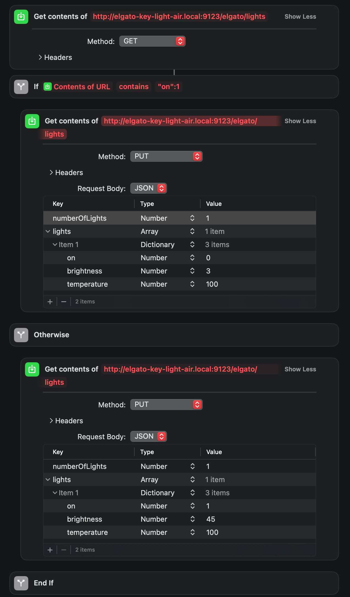

## Overview

The Elgato Key Light Air has a hidden unprotected HTTP API running on the device at all times. This API lives behind port 9123 and allows for information GETting and PUTting. This allows anyone to get the current configuration of the light and update those values. The original source for the finding of this API can be found [here](https://www.ntpro.nl/blog/archives/3613-Postman-and-the-Elgato-Key-Light-Air-API.html).

The JSON used for the GET/POST request looks like this:

```json
{
    "numberOfLights": 1,
    "lights": [
        {
            "on": 1,
            "brightness": 20,
            "temperature": 200
        }
    ]
}
```

We can translate this with the new functionality of "Siri" Shortcuts on iOS to control the light remotely without needing the Elgato Control Center app.

## Step 1: Connect Light to Network

I completed this process on a Mac, the guide for this can be found on [Elgato's page](https://help.elgato.com/hc/en-us/articles/360038128812-Key-Light-Air-Quick-Start-Guide). Essentially, the steps boil down to this:

1. Turn On Light
2. Download Elgato Control Center on Mac
3. Open Airport Utility on Mac
4. Select the: `Other Wi-Fi Devices` option in the top left of Airport Utility
5. Click on the Key Light: choose the network to attach it to and name it accordingly

That should complete the installation, the Elgato Control Center app should show the light and all should work accordinly.

## Step 2: Find mDNS Information

We can find the IP Address of the Key Light Air a multitude of different ways:

- In the routers list of devices
- IP scan of the network
- I'm sure there are more...

All of these assume that the IP address of the light will never change, but since the light provides an mDNS name set based off the setup name we chose in the previous step, we can use that instead to prevent ourselves from changing the IP address down the line in our shortcut.

I used [mDNS Browser](https://apps.apple.com/us/app/discovery-dns-sd-browser/id1381004916?mt=12) to find the mDNS name for my Key Light Air.

You can use these commands in the terminal to get pretty close to finding the mDNS infromation:

```bash
dns-sd -B _services._dns-sd`
dns-sd -B _elg._tcp
# Something else to get the actual name...
```

Lastly, you can find the mDNS name by simply taking the name you entered and adding "-" where there was a space. This would take "Light Air" to an mDNS of "light-air.local".

Back to the mDNS Browser, you can find your light with the GUI and copy and paste your mDNS name out. No matter what method you use, your mDNS should look similar to this: `elgato-key-light-air.local`. The name of your light and the `.local` domain appended.

## Step 3: Build Shortcut

If you just want to have it work, grab the preset shortcut from [here](https://www.icloud.com/shortcuts/833ef8865ac04168aa26f5bdff00ec5a) and replace `IPADDRESSHERE` with the mDNS name previously found.

Otherwise, you can build it out manually using a similar syntax to the above one! The steps in you shortcut would look like:

1. Add a `Get Contents of` block to the start
2. The URL will look something like this: `http://elgato-key-light-air.local:9123/elgato/lights`
3. Set the method to GET to retieve information
   - We have gotten the current status of the light
4. Add an `If` block after the GET
5. Test if `Contents of URL` does `contain` the JSON `on: 1`
    - If the light is on, do something (turn off) otherwise do something else (turn on)
6. Add a `Get Contents of` with the same URL to the API as Step 3
7. Change the method to PUT (this will change the config currently on the light)
8. Build out the JSON for configuration we'd like light to go to
   - This will turn the light off
9. Add an `Otherwise` block
10. Add a `Get Contents of` with the same URL to the API as Step 3
11. Change the method to PUT (this will change the config currently on the light)
12. Build out the JSON for configuration we'd like light to go to
    - This will turn the light on

This all boils down two a GET request to see the current configuration of the light. If the light is currently on (`on: 1`), execute the code to cause the light to do something. In this case, I set the `on` field to `0` which will turn the light off. On the flip side, if the light is off (`on: 0`) the other block will get executed and the `on` field will be set to `1` turning the light on. My final shortcut looked like this:



## Profit

And with that, you can add it to "Hey Siri" (or just "Siri" now) so that you can control the light completely untethered. This article isn't super in-depth but should help get you up and running without needing to have to open the Control Center app constantly for your light. There is more customization that can be done by editing the `brightness` field and whatnot. You can turn the brightness down if it's above a threshold or more, the customization is pretty boundless to suit your needs.
