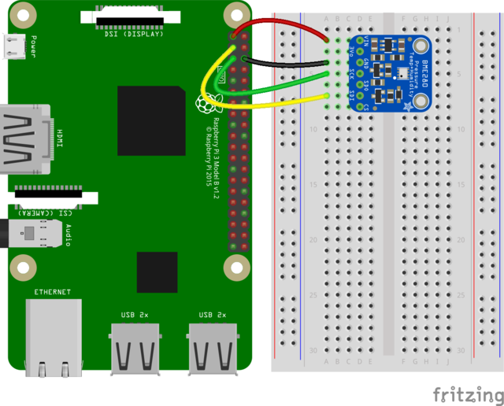
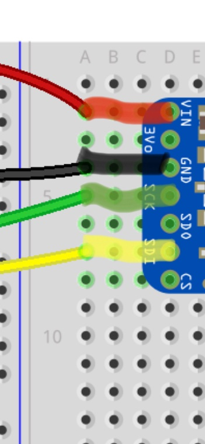
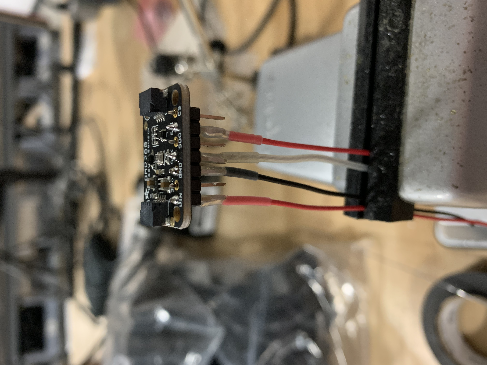

## The Tech

Let's build out our little form factor advanced thermometer.

### The BMP280

This little sensor is fantastic for measuring a host of information and all of it can be relayed over the I2C interface to the other piece of the puzzle. The main data points are temperature (with ±1.0°C accuracy), barometric pressure (±1 hPa absolute accuracy), and altitude (±1 meter accuracy). The main ones that are pretty neat here are temperature and barometric pressure; altitude comes built into the BMP280 by default but since we aren't going to be moving this sensor much it's not really something that we will need to keep tabs on. The other two readings are key for knowing how hot the room is and I normally use pressure for knowing if a door has been left open or if the A/C has stopped for some reason. This cool little sensor can be purchased [here](https://www.adafruit.com/product/2651) for $9.95 at the time of writing.

### The Raspberry Pi

The gold standard of small form factor computing, we are using a Raspberry Pi 4B. This device is not only small and low power so we can put it anywhere, but it has GPIO pins directly on the board that allow use to hook our BMP280 directly to the board and read off it. Since the Pi is small enough to live just about anywhere it has power, it will be perfect to live behind or in front of our rack. I ended up using an 8GB model since that was all I had left, but you could probably get away with only using a single GB or two since the script we will use to report the data is not anything heavy. Depending on when you're reading this, Raspberry Pi's can be very hard to find but you can see if any are available on the [Raspberry Pi website](https://www.raspberrypi.com/products/raspberry-pi-4-model-b/).

## The Soldering

Alright, this section is pretty short since I had to call in my good friend to do the soldering for me since I am a total novice at it. There is just some work to be done getting the BMP280 to the Raspberry Pi but I can only explain the basics of it here. There's a helpful blog post that shows the pin mappings which can be found [here](https://learn.adafruit.com/circuitpython-on-raspberrypi-linux/i2c-sensors-and-devices#wiring-2993403-10). This tutorial shows using a breadboard and jumper wires, but due to my installation I didn't want it falling apart if I ended up slamming it around in the racks at some point; so, I stuck with soldering in a similar but if you want to make headway with the breadboard: go for it!

There's only four key connections that we need between the two pieces of tech, those are: <br>

- Connect the Raspberry Pi **3.3V** power pin to the BME280 **VIN** <br>
- Connect the Raspberry Pi **GND** pin to the BME280 **GND** <br>
- Connect the Raspberry Pi **SDA** pin to the BME280 **SDI** <br>
- Connect the Raspberry Pi **SCL** pin to to the BME280 **SCK** <br>

These images kinda show the rest of the process. For the breadboard image, all credit goes [here](https://learn.adafruit.com/assets/56786).





Alright, that's the hard part if you aren't really good with soldering. Don't forget you can just use some small cheap jumper cables to make your life much easier. On the the fun part, our Raspberry Pi!

## Pi Setup

The main hub of this whole smart operation: the Pi!!!! This guide is going to skip installing an OS to the Pi, if you would like to follow some instructions on that head [here](https://www.raspberrypi.com/documentation/computers/getting-started.html). I used Raspbian (now named Raspberry Pi OS) for this device as a nice lightweight and pretty much completely setup package. Once you've got the Pi booted and connected to a display (VNC, SSH, or over HDMI), let's get our stuff installed!

### Installing and Enabling

Lets start with some things that we know that we'll need in the long run. Mainly this is Python3, but we should also do a system update to make sure everything is up to date. We'll run the following commands to install some jazz:

```bash
sudo apt update && sudo apt upgrade
sudo apt install python3 idle3 python3-pip python3-smbus i2c-tools
```

Okie, we got the all installed well and dandy but we still need to install some `pip` packages to get the rest of it up and going.  

```bash
sudo pip3 install adafruit-blinka && sudo pip3 install Adafruit_Python_DHT && sudo pip3 install adafruit-circuitpython-bme280 && sudo pip3 install adafruit-circuitpython-bmp280 && sudo pip3 install requests
```

Last piece of setup is enabling our I2C interface on the Raspberry Pi so we can communicate with our BMP280. We will run the Raspberry Pi config tool and have to go through a few different things.

```bash
sudo raspi-config

```

We will scroll down the config page using the arrow keys to the fifth option or "Interfacing Options". Hit enter to go into it that menu and then head to Option \#8 or "Advanced Options". We can then scroll down to Option \#A7 or "I2C". We want hover over the "Yes" option to enable I2C and the click the enter key. It will then ask you if this should be loaded by default, since we want it to be we will select "Yes" again. After that, we can back all the way our of the config menu and get back to our normal console.

### Testing and Troubleshooting

We can see if the I2C interface is working and our wiring is good by running the following command.

```bash
sudo i2cdetect -y 1
```

This will load a matrix onto the screen and there should be one slot filled; however if it's all '\_\_', the device wired in isn't connected properly and you may want to check your pin configuration and wiring.

Assuming we see our device wired in, let's go ahead and see if we can pull some data from it and print it to the screen. We are going to head into the [Python Interpreter](https://docs.python.org/3/tutorial/interpreter.html#using-the-python-interpreter) and run a few commands to see if we can get data from the screen. The Python Interpreter is great for just running a few short commands and printing some information to the screen. Once we load into the Python3 interpreter, lets import the needed libraries for the BMP280 and then set up our interface with the I2C config on the Pi. After that, we declare a variable that holds the connection to our BMP280 over the I2C connection. With that variable, we can print our the temperature to ensure it's working correctly. This can be seen in the commands below!

```python
>>> import board
>>> import adafruit_bmp280
>>> board_i2c = board.I2C()
>>> bmp280 = adafruit_bmp280.Adafruit_BMP280_I2C(board_i2c)
>>> print(bmp280.temperature)
25.01796875
```

## InfluxDB & Grafana Setup

This section is going to build off my last blog post on creating a InfluxDB and Grafana stack in a Google Cloud Compute VM. If you would like to read about that adventure, you can find the whole post [here](https://zars.me/blog/index.php?post/2022/04/26/Setting-Up-a-Grafana-InfluxDB-UnPoller-Docker-In-GCP). We just have to setup a database in InfluxDB that we will send our data to for keeping it recorded. Then, we have to make that data available to Grafana as a data source.

### InfluxDB Database Creation

Since we set up the entirety of InfluxDB last time, we just need to enter into the container and add a database and retention policy. In order to do this, we will need to SSH back into our Google Cloud Compute VM and bring our docker-compose online if it is not. Once it is up and running, we want to get into the shell of our InfluxDB container so we can access the command line for the Influx tool. We can get BASH access by running the following command.

```bash
sudo docker exec -it up_influxdb /bin/bash
```

From here, we need to manually declare our database that we want to make that will store the data relayed from the Raspberry Pi. This can be done in only a few simple commands. We will make our database, create a new admin user for the created database, and we will set a retention policy on the created database. Also note, before doing anything too crazy we need to get into the InfluxDB shell which can be done with `influx` inside the docker container. Once into the InfluxDB shell, we can get rolling with the following commands to set it all up.

```bash
CREATE DATABASE pi_monitoring_sensors
USE pi_monitoring_sensors
CREATE USER your_user WITH PASSWORD 'your_password' WITH ALL PRIVILEGES
CREATE RETENTION POLICY "pi_monitoring_sensors_1_week" ON "pi_monitoring_sensors" DURATION 1w REPLICATION 1 DEFAULT
SHOW RETENTION POLICIES
```

This is luckily really simple to execute and should hopefully have no issues for you. You can name your database whatever you want, I decided to name mine "pi_monitoring_sensors" for ease of use. Also, make sure to jot down the username and password you choose since there is no way to retrieve the password after creation. We then make a retention policy of one week again to prevent overflowing the container with too many readings. We also just double check that our policy is all set and active by showing all policies on the database.

### Grafana Configuration

This section tracks pretty close to the last time we added a data source to Grafana, so I'm going to repeat the same infomation over once again. Log into Grafana and head into the left sidebar and click into the configuration menu. It well default to opening the data sources tab, we are going to add a new data source by clicking the “Add Data Source”. From the list, choose “InfluxDB” and head onto the configuration page for our data source. The first field we will need to fill out is the “URL” where we will want to put our `http://up_influxdb:8086`. Upon scrolling down to the bottom, we will see some fields for username, password, and database; in these fields, we want to put the corresponding information that we just created in the step above. Once you are all set, hit the “Save and Test” button and if it turns green you are all set to keep on rocking.

## Sending Data from the Pi

### Initial Setup

Now, we can get to the fun part of actually sending the data we have found up into the InfluxDB database. This will be done entirely in one nice little Python file that just runs a loop forever and ever till we manually stop it. During my undergrad at Florida Tech, I learned C to start but have since become proficient in Python and this is a nice little script that I developed to print the information nicely to the console and send it off to Influx. We can make our file anywhere on the Raspberry Pi, I decided to make a folder and build my file in there with my favorite command line editor: Nano! The commands to do that are below.

```bash
mkdir /home/pi/Desktop/bmp280/
cd /home/pi/Desktop/bmp280/
nano influx_db_data_send.py
```

This creates a directory for our file to be kept in and we make a Python file that can be executed. The contents of this Python file can be found at the bottom, but we will break down the whole file into manageable chunks here.

### The Sacred Python File

We start off our Python file with the necessary imports to send out data, pause our program, access the I2C interface/BMP280, and get the hostname of the device we are running on.

```python
# CURL data to InfluxDB server
import requests

# Timing & Sleeping
import time

# Used for accessing GPIO pins and the I2C interface
import board
import adafruit_bmp280
import digitalio

# Get hostname
import socket
```

We then move onto our next step of opening our interface to the sensor. This part is identical to our steps from testing if the sensor was working, but just so it can be put all together, we add these lines to the file.

```python
# Open communications with the sensor
board_i2c = board.I2C()
bmp280 = adafruit_bmp280.Adafruit_BMP280_I2C(board_i2c)
```

The next part is where we actually start to process and print out our data to the end user. The data from the sensor comes in as Celsius for temperature, hPa for pressure, and meters for altitude; however, we have to do a few conversions to different units so that we can display the data as either metric or customary. We grab the data from the sensor for each of our three data points and then convert it. We make some fancy strings that print to the screen what measurement it is and all the data that we have and have calculated. I print a row of '\*' to show the data in an easily distinguishable manner. We do the rest of the program in this while loop to send data forever (it can still be exited with Control+C).

```python
# Loop until program is exit
while True:
    ########################
    # On device statistics #
    ########################
    print('-'*75)

    # Calculate Temperatures
    celsius_temp = bmp280.temperature
    fahrenheit_temp = 9.0/5.0*celsius_temp + 32

    print("{} F".format(fahrenheit_temp))

    # Read in pressure (hPa)
    pressure = bmp280.pressure

    print("{} hPa".format(pressure))

    # Calculate altitude
    meters_alt = bmp280.altitude
    yards_alt = meters_alt * 1.09361
    feet_alt = yards_alt * 3

    print("altitute: {} meters, {} yards, {} feet".format(meters_alt, yards_alt, feet_alt))
```

Now that we have seen the data, we want to format it and send it up to our VM. However, we need to follow some special syntax for this to work properly. You can read all about the InfluxDB API and CURL'ing data on their website [here](https://docs.influxdata.com/influxdb/v1.8/guides/write_data/). We will set up our strings in a manner that the Requests Python library will accept. We get our device name from the socket library so we can identify it in Grafana and set our URL string equal to the VM IP and InfluxDB and port. The other half of the URL is specifying that we are writing data to the database and what database the information should be going to. We then format a bunch of strings that contain our data from the previous calculations. Influx needs the strings formatted in the manner of "table,device,data".

```python
while True:
    # ... Other code from previous steps!!!
    
    ##################################
    # Prepare statistics to InfluxDB #
    ##################################
    device_name = socket.gethostname()

    # Actual URL String
    url_string = 'http://**GCP-VM-PUBLIC-IP**:8086/write?db=pi_monitoring_sensors'

    # Format temperature data
    temp_data_string = 'temperature,pi={} celsius_temp={},fahrenheit_temp={}'.format(device_name, celsius_temp, fahrenheit_temp)

    # Format pressure data
    pressure_data_string = 'pressure,pi={} hPa={}'.format(device_name, pressure)

    # Format altitude data
    altitude_data_string = 'altitute,pi={} meters_altitude={},yards_altitude={},feet_altitude={}'.format(device_name, meters_alt, yards_alt, feet_alt)
```

Lastly, we need to send the data to InfluxDB with our nicely formatted strings. My first implementation was very barebones with no error checking or exception handling, but if we have any issues with our GCP VM or need to restart it our Python program would crash and require us to start the script back up. We can fix this issue by using the wonderful `try:except` statement available in Python. This allows us to catch an exception that would break our program, and rather report the error and try again. We try to send three request, one request with each section of data (temperature, pressure, and altitude). If successful on all of them, we wait 5 seconds before gathering more data and running the loop over again. If there is an exception, we will print out that the server is not responding and wait 30 seconds before trying it again.

```python
while True:
    # ... Other code from previous steps!!!
    
    ###############################
    # Send statistics to InfluxDB #
    ###############################
    try:
        temperature_request = requests.post(url_string, data=temp_data_string)
        pressure_request = requests.post(url_string, data=pressure_data_string)
        altitude_request = requests.post(url_string, data=altitude_data_string)
        time.sleep(5)
    except requests.exceptions.RequestException: # If error, wait 30 seconds and try again
        print("Oh no! Something happened writing to InfluxDB!")
        time.sleep(30)
```

This script could definitely be made to have more robust error checking by analyzing the response codes from each request or having some more exceptions built into the `try:except` statement.
**Sweet, that's the programming part done!**
Alright, lets run this to get some data flowing up to our Influx database. After we see a few items successfully reach the database, we can configure dashboards in Grafana. We can run our file by doing the following command, do note since it is in a while loop the terminal window must stay open while it runs.

```bash
cd /home/pi/Desktop/bmp280/
python3 influx_db_data_send.py
```

## Grafana Dashboard Setup

The data is successfully leaving our Pi and making it up to InfluxDB, but now we need to make it all look pretty in a Dashboard. Once logged into Grafana, click onto the "+" (plus) in the right menu bar to add a new dashboard we're going to build.

### Getting Our Data

Once here, we will be greeted with the option to add a panel, go ahead and click into the panel by hitting "Add a new panel". We are greeted by a page with a lot of different options, don't fret though. We are going to start in the bottom left and work our way across. We want to select the correct data source to pull from, so in the "Data source" dropdown, choose the data source you made a few steps ago. Moving straight down, we are going to select the measurement you want (I start with temperature) in the "select measurement" box. Once you click, it will dropdown the options available so you can select temperature. To the right of that box is another "+", click on it and chose the "pi" option. This lets Grafana know which device we want to take information from; in this case, we want whatever our pi is named so we select that in the "select tag value" box a little bit more to the right. Lastly, in the "SELECT" field we will want to set "field(value)" to be our temperature which can be achieved by clicking into that box to select the temperature we want. You can select any option here and it will allow you to do pretty much any combination. If you have multiple devices, you can average them together and more. Play around and see what you can do!

### Presenting Our Data How We Want

The right hand panel now contains all the customization we can do to present the data how we want. At the top, it's most likely selected as a "Time Series" but we can choose other options if we want. Stat, gauge, and bar graphs are really neat and you can customize all of them to your liking; but, for this tutorial we are going to stick with Time Series. We will want to give our title an appropriate name (Sensor Pi Temp in F) or something. The next few options of "Tooltip", "Legend", "Graph Styles", and "Axis" can all be customized to make it look however you want it too look. This is where some playing around with the options will help you find what looks best. Under "Standard Options", we are going to want to change the 'Unit' to the appropriate measurement (for me that is Fahrenheit). Otherwise, we can skip on past the more customization of "Data links" and "Value mappings" to set any thresholds we want to see data display in different colors. This can be really useful for the stat visualization as it will allow you to turn the number red based off of different temperature readings. Once you like the way your graph looks, we can exit by hitting the "Apply" button in the top right.

### Saving Our Dashboard

Since we've made our panel, we want to save this dashboard. This can be accomplished by clicking the save icon in the top right hand corner and giving it a name. Once saved, this dashboard can be loaded with the graph already all made and setup.

## That's All Folks

In my next pieces, I'll go over setting up alerts for Discord and Microsoft Teams so we can get notifications if the temperature or pressure suddenly changes or goes over a specified threshold. I hope to upload my dashboard to Grafana and share the link here so you can download it as is! Feel free to comment issues or questions, but otherwise thanks for reading!
